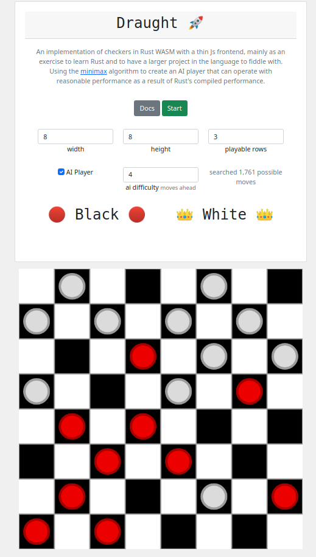

Draught
===============

## [Try it Out!](https://sarsoo.github.io/draught/)

WebAssembly-based checkers game with a minimax-based AI player.

Rust WASM module for game logic with a JS frontend for rendering and processing user input.

## Building

1. Setup a Rust + wasm-pack environment and a Node environment
2. Build the Rust library into a WASM module 
    - `wasm-pack build`
3. Move to the Js workspace 
    - `cd www`
4. Install the Js dependencies
    - `npm install`
5. Build the Js frontend with Rust WASM module
    - `npm run build`